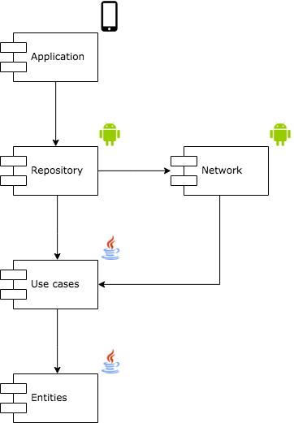

Modules:
* __android-ui__ (Android application)
* __repository__ (Android library)
* __network__ (Android library)
* __usecases__ (Kotlin library)
* __entities__ (Kotlin library)

__android-ui__ uses __usecases__ to run its loop, and plugs in the
concrete implementation of `UseCase` from __repository__.

